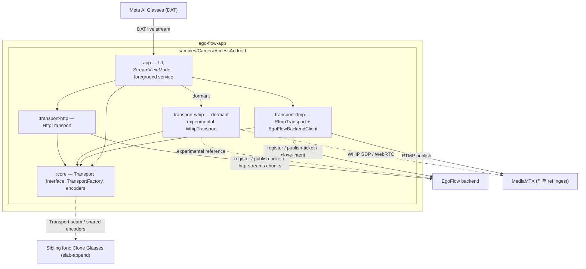
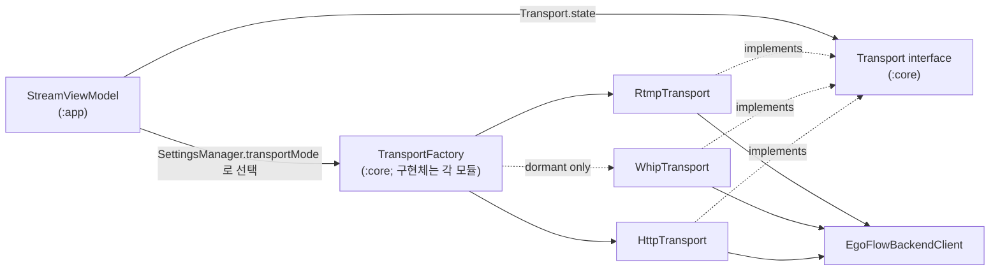
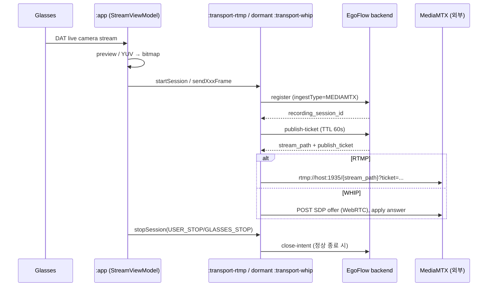
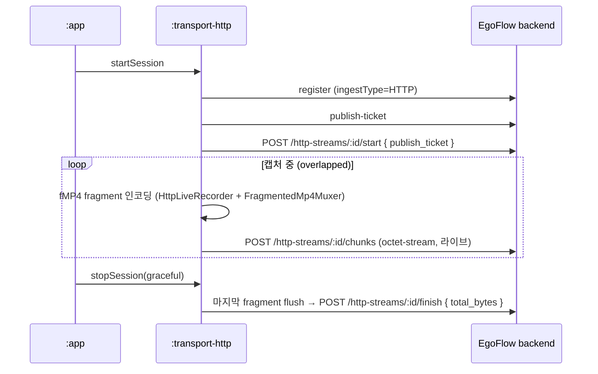

# EgoFlow App Architecture

이 문서는 `ego-flow-app` 저장소 안의 전체 흐름을 아키텍처 관점에서 정리한다.

## 1. 전체 구조

본 저장소는 RTMP / WHIP / HTTP 구현 모듈을 모두 포함한다. `v0.0.1` 제품 UI와 실기기 acceptance는 RTMP/RTMPS와 HTTP만 대상으로 하며, WHIP 모듈은 비활성 실험 코드다. slab-append 기반의 Clone-server 트랙만 sibling fork인 **Clone Glasses**가 담당하며, 두 저장소는 `:core`의 `Transport` 인터페이스/`VideoEncoder` 등 공유 자산을 같은 모양으로 유지하는 fork 전략으로 분리됐다. fork 위치는 `samples/CameraAccessAndroid/README.md`의 "Sibling fork" 절 참고.

## 2. CameraAccessAndroid 모듈 구성

CameraAccessAndroid는 다섯 개의 Gradle 모듈로 나뉜다 (`settings.gradle.kts`).

| 모듈 | 역할 | 핵심 타입 |
| --- | --- | --- |
| `:app` | Android entrypoint, UI, foreground service, `StreamViewModel`, settings, DAT/phone 소스 분기 | `MainActivity`, `StreamViewModel`, `StreamingService`, `ui/*`, `settings/SettingsManager` |
| `:core` | transport-agnostic 공통 — `Transport` 인터페이스, `TransportFactory`, codec/state 타입, video encoder, YUV 변환 | `core/transport/api/Transport`, `TransportFactory`, `TransportTypes`, `core/encoder/VideoEncoder`, `YuvFrameConverter` |
| `:transport-rtmp` | RTMP/RTMPS 구현 + 공유 `EgoFlowBackendClient` + auth/repo prefs | `transport/rtmp/RtmpTransport`, `stream/rtmp/RtmpStreamer`, `RtmpPublisher`, `egoflow/EgoFlowBackendClient`, `settings/AuthPrefs`, `RepoPrefs` |
| `:transport-whip` | dormant/experimental WHIP(WebRTC-HTTP Ingestion) 구현; `v0.0.1` UI 선택 불가 | `transport/whip/WhipTransport`, `WhipClient`, `WhipPeerConnection`, `WhipTransportFactory` |
| `:transport-http` | fragmented-MP4 chunk 업로드 구현 | `transport/http/HttpTransport`, `HttpLiveRecorder`, `FragmentedMp4Muxer`, `HttpLiveUploader`, `HttpTransportFactory` |

`:app`은 `:core`의 `Transport` 인터페이스에만 의존한다. 각 transport 구현은 자기 모듈 안에 봉인되어 있어 다른 transport(예: fork의 slab-append)가 같은 seam을 따라 들어올 수 있다.

> `EgoFlowBackendClient`(register/publish-ticket/close-intent/http-streams 제어면)는 물리적으로 `:transport-rtmp`의 `io.egoflow.app.egoflow` 패키지에 있고, WHIP/HTTP 구현 모듈이 이를 재사용한다. 이 구조 설명은 WHIP의 release support를 뜻하지 않는다.

## 3. Transport seam

- `StreamViewModel`은 `Transport` 인터페이스만 참조한다.
- 내부 enum/factory는 `TransportId.RTMP` / `WHIP` / `HTTP`를 인식하지만, `v0.0.1` Record UI는 RTMP와 HTTP만 선택한다. `recordTransportMode()`와 `normalizeRecordTransportMode()`는 저장된 WHIP 값을 RTMP로 정규화한다.
- 지원되는 RTMP/HTTP 선택을 바꾸면 다음 세션 시작 시 transport 인스턴스가 교체된다(idle일 때 `maybeRebuildTransport`). WHIP factory는 향후 검증용으로만 남아 있다.
- `TransportId`에는 `SLAB`도 있지만 본 앱에는 wiring 되어 있지 않다(선택 시 RTMP로 fallback). slab 구현은 sibling fork에 있다.

### 3.1 Transport 인터페이스 표면

`core/transport/api/Transport.kt`의 실제 메서드:

- `startSession(sessionId, codec)` — 사전 handshake(publish ticket, auth 등)를 끝내고 프레임 수용 준비. 실패 시 `TransportStartException(reason)`.
- `sendGlassesFrame(frame)` — raw YUV glasses 프레임. transport가 자체 MediaCodec으로 인코딩.
- `sendGlassesFrameCompressed(frame)` — glasses가 이미 인코딩한 HEVC NAL 패스스루(재인코딩 없음).
- `sendPhoneFrame(i420, w, h)` — planar I420 phone-camera 프레임.
- `stopSession(reason)` — flush/release. idle에서 호출해도 no-op.
- `state: StateFlow<TransportState>` / `videoFramesSent()` — UI가 소비하는 상태와 송신 프레임 카운터.

transport-specific 개념(publish ticket, byte offset, HLS URL 등)은 이 표면에 올라오지 않고 각 구현 안에 머문다.

## 4. transport별 데이터 흐름

RTMP와 HTTP 지원 경로 및 dormant WHIP 구현은 `register → publish-ticket` 제어면을 공유하고, 정상 종료 시 `close-intent`(NORMAL_DISCONNECT)를 best-effort로 보낸 뒤 세션을 닫는다. **owner-lease heartbeat와 자동 reconnect는 없다.** mid-stream 세션 사망은 앱이 아니라 서버/MediaMTX의 read/write timeout + hook이 감지한다. 실패/네트워크 유실 시 앱은 close-intent를 생략하고(서버가 UNEXPECTED_DISCONNECT로 기록) 에러를 노출한 뒤 device selection으로 돌아간다.

### 4.1 RTMP 지원 경로 / WHIP dormant 참고 경로 (ingestType `MEDIAMTX`)

- RTMP: `publishUrl = rtmp(s)://{host}:1935/{stream_path}?ticket={publish_ticket}`. 인코더는 H.264/HEVC. 오디오는 옵션(mic source auto/glasses/phone).
- WHIP dormant 구현: register/publish-ticket는 RTMP와 동일하다. 이후 WHIP URL을 만들고 WebRTC offer/ICE → SDP POST → answer 적용 → CONNECTED되면 Streaming하는 코드가 남아 있다. 협상 결과 코덱은 H.264, 오디오 없음(video-only)이며 glasses HEVC 패스스루는 drop한다. 이 경로는 `v0.0.1` UI에서 선택되지 않고 실기기 acceptance에도 포함되지 않는다.

### 4.2 HTTP-chunk (ingestType `HTTP`)

- 캡처와 업로드가 겹쳐서(overlapped) 진행된다. 예전의 "record 후 stop 시 통째 업로드" 방식이 아니다.
- 업로더는 서버의 10초 idle timeout이 발동하지 않도록 최소 간격으로 flush(heartbeat 성격)한다. video-only.
- foreground `StreamingService`가 세션과 마지막 drain 동안 프로세스를 살려둔다.

## 5. 왜 슬랩 트랙은 fork로 분리했는가

slab-append → Clone server 트랙을 동일 저장소의 별도 모듈(`:transport-slab`)로 두는 안을 한 번 시도했다가 revert 했다 (커밋 `a6f3a89`). RTMP/WHIP/HTTP 구현 모듈은 Android UI/glasses 연결 자산과 backend 제어면(register/publish-ticket/close-intent)을 공유하지만, slab-append는 서버 프로토콜·세션 모델·실패 모드가 크게 달라 한 저장소에서 유지할 때 모듈 경계가 자주 깨졌다. 대신 `:core`의 `Transport` 인터페이스와 encoder 자산만 동일하게 유지한 채 Clone Glasses를 **fork**로 분리했다.

## 6. 구현 읽기 순서

1. `samples/CameraAccessAndroid/README.md` (Module layout, Sibling fork 절)
2. `core/src/main/java/io/egoflow/app/core/transport/api/` — seam 타입(`Transport`, `TransportTypes`, `TransportFactory`)
3. `app/src/main/java/io/egoflow/app/stream/StreamViewModel.kt` — Transport 소비자 + `buildTransport()`
4. `transport-rtmp/src/main/java/io/egoflow/app/egoflow/EgoFlowBackendClient.kt` — 세 구현 모듈이 공유하는 backend 제어면
5. `transport-rtmp/.../transport/rtmp/RtmpTransport.kt`, `transport-whip/.../WhipTransport.kt`, `transport-http/.../HttpTransport.kt` — 세 구현 (WHIP은 dormant/experimental)
6. RTMP 세부는 [04. project_rtmp_android.md](./04.%20project_rtmp_android.md)
